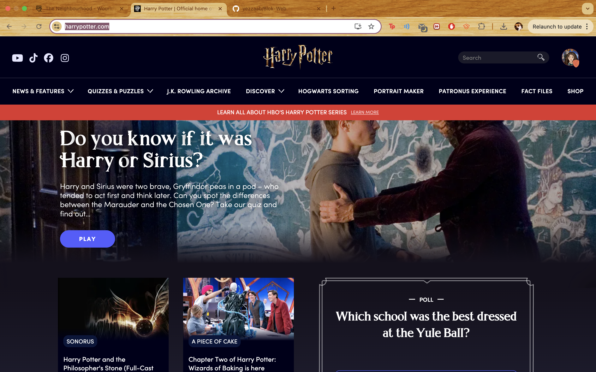
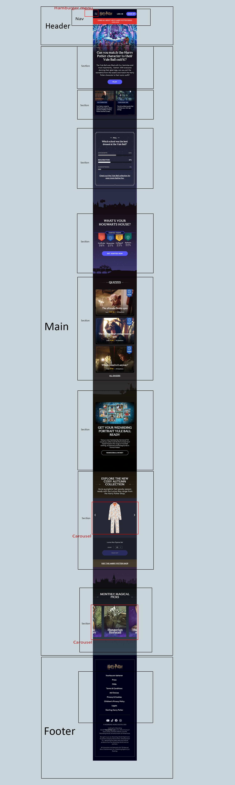
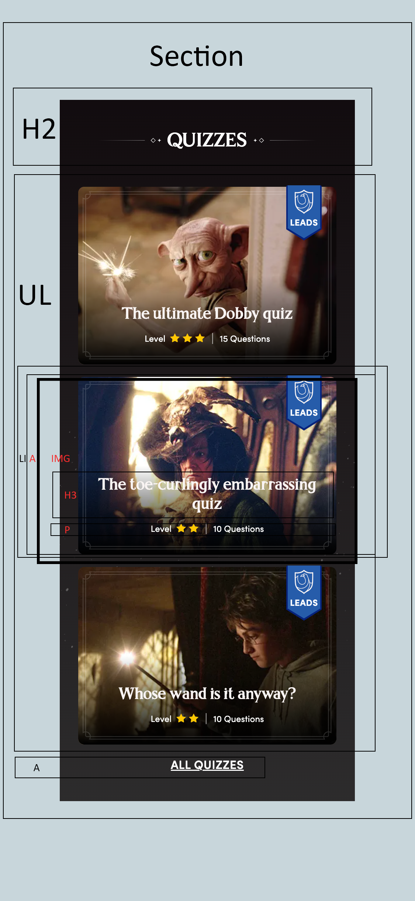

# Procesverslag
Markdown is een simpele manier om HTML te schrijven.  
Markdown cheat cheet: [Hulp bij het schrijven van Markdown](https://github.com/adam-p/markdown-here/wiki/Markdown-Cheatsheet).

Nb. De standaardstructuur en de spartaanse opmaak van de README.md zijn helemaal prima. Het gaat om de inhoud van je procesverslag. Besteedt de tijd voor pracht en praal aan je website.

Nb. Door *open* toe te voegen aan een *details* element kun je deze standaard open zetten. Fijn om dat steeds voor de relevante stuk(ken) te doen.

## Jij

  
uitwerken voor kick-off werkgroep

  ### Auteur:
Yezza Abnali

  #### Je startniveau:
Blauw

  #### Je focus:
Responsive
 

## Je website

  
uitwerken voor kick-off werkgroep

  ### Je opdracht:
[Harry Potter Website](https://www.harrypotter.com/)

  #### Screenshot(s) van de eerste pagina: 
  Start scherm

  

  #### Screenshot(s) van de tweede pagina:
  Profiel Scherm

  
 

## Toegankelijkheidstest 1/2 (week 1)

  
uitwerken na test in 2e werkgroep

  ### Bevindingen
  Lijst met je bevindingen die in de test naar voren kwamen:
  -  Alle bovenste opties worden duidelijk beschreven, ook gaat ie naar het logo van de website en heeft deze een duidelijke naam, waardoor je weet op welke website je bent. Er is ook bij de zoekbalk "trending searches" waarna deze worden benoemd. Dit zorgt er voor dat je sneller bij een populaire term kan komen.
  -  Bij de 2e heading leest ie niet de tekst voor, maar benoemd hij alle letters los van elkaar. Deze extra toevoegingen, worden ook bij de Quizzes opgelezen. Hoewel de kopjes daarvoor wel normaal worden opgelezen. Ook staat er bij de verschillende quizzes waarschijnlijk dubbele code, waardoor hij de titel 2 keer voorleest. Ook zegt hij voor elke header "Heading level 2".
  -  Wanneer je Headers navigeert variert het per onderwerp of hij alleen de titel benoemt of ook de verschillende onderste sections benoemd. Zo gaat hij bij de quizzes en shop wel langs de items en bij de rest niet.
  -  Bij de helft van de links in de header worden de link namen dubbel gezegd, dit is niet het geval bij de rest van de links. Ook is er bij de derde Carousel extra text die word opgenoemd, dit is waarschijnlijk een file sort. Dit probleem was er niet bij de vorige carousels.
  -  Er is met kleur heel goed nagedacht over het contrast. Zo is alles heel goed uit elkaar te halen ook met de verschillende soorten kleurenblindheid zou je de website nog zonder probleem kunnen gebruiken. Het contrast tussen de tekst is ook duidelijk, het enige twijfelgeval is bij de "toe curling embarrassing quiz" aangezien de tekst op een afbeelding met licht is gezet.
  -  Er zijn geen verschillende versies voor light en dark mode, de website zelf zou ik wel beschrijven als een dark-mode website.

## Breakdownschets (week 1)

  
uitwerken na afloop 3e werkgroep

  ### de hele pagina: 
  

  ### dynamisch deel (bijv menu): 
  

## Voortgang 1 (week 2)

  
uitwerken voor 1e voortgang

  ### Stand van zaken
  Een website uitgekozen (Harry Potter) en voor webpagina 1, grotendeels van de html geschreven.

  ### Verslag van meeting
  hier na afloop snel de uitkomsten van de meeting vastleggen

  - Articles eruit halen en veranderen in sections.
  - Verder goede duidelijke html geschreven.
  - Voeg de afbeeldingen nog toe.
  - Duidelijke breakdownschets gemaakt.
  - Goed uitgebreide toegankelijkheidstest uitgevoerd en genoteerd.
 

## Voortgang 2 (week 3)

  
uitwerken voor 2e voortgang

  ### Stand van zaken
  Week lang ziek geweest, heb wel al de html geschreven en nu een inhaalslag maken.

  ### Verslag van meeting
  - Niet veel veranderd.
  - Kleuren gevonen van de originele website.
  - Image downloader gevonden.
  - Volgende week weer knallen.

## Toegankelijkheidstest 2/2 (week 4)

  
uitwerken na test in 9e werkgroep

  ### Bevindingen
  Lijst met je bevindingen die in de test naar voren kwamen (geef ook aan wat er verbeterd is):

## Voortgang 3 (week 4)

  
uitwerken voor 3e voortgang

  ### Stand van zaken
Vorige week helaas weinig tot niks kunnen doen. Deze week lekker gewerkt, eerste pagina is af voor mobile, veel gecodeerd met responsiveness in het achterhoofd. Of misschien toch switchen naar Surface plane?

  ### Verslag van meeting
  hier na afloop snel de uitkomsten van de meeting vastleggen

  - Verder met Responsive maken voor desktop.
  - Goed bezig, werkt goed alleen is er een afbeelding te groot? (Bleek ingezoomd)(Gefixt)

## Eindgesprek (week 5)

  
uitwerken voor eindgesprek

  ### Je uitkomst - karakteristiek screenshots:
  

  ### Dit ging goed/Heb ik geleerd: 
  Korte omschrijving met plaatjes

  

  ### Dit was lastig/Is niet gelukt:
  Korte omschrijving met plaatjes

  

## Bronnenlijst

  
continu bijhouden terwijl je werkt

  1. https://www.clipartmax.com/max/m2H7G6H7Z5H7K9Z5/ , PNG Harry Potter logo
  2. https://www.w3schools.com/howto/howto_js_navbar_hide_scroll.asp
  3. https://www.w3schools.com/css/css3_transitions.asp transition code 
  4. https://css-tricks.com/snippets/css/complete-guide-grid/ Grid Guide
  5. https://www.w3schools.com/css/css_list.asp code om de puntjes weg te halen
  6. carousel code: https://developer.mozilla.org/en-US/docs/Web/CSS/Guides/Overflow/Carousels, https://css-tricks.com/almanac/properties/s/scroll-behavior/
  7. webppagina button redirect https://www.w3schools.com/howto/howto_js_redirect_webpage.asp en https://www.w3schools.com/jsref/event_onclick.asp

